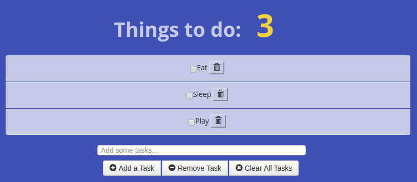

[](https://travis-ci.org/LearnTeachCodeSeoul/todo)
[](http://standardjs.com/)

# ToDo Web App


## Screenshot



## How to run

```
$ npm start
```

## How to test

```
$ npm test
```

## How to develop

```
$ npm run dev
```

## How to lint

```
$ npm run lint
```

### How to fix simple lint errors
```
$ npm run lint-fix
```
